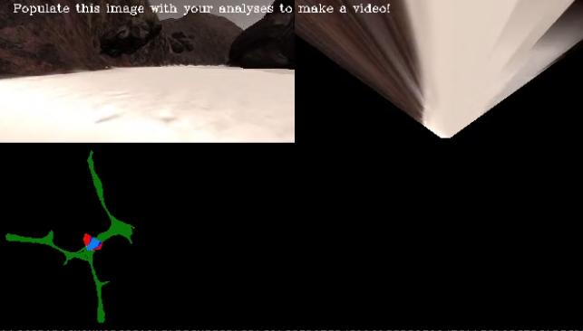
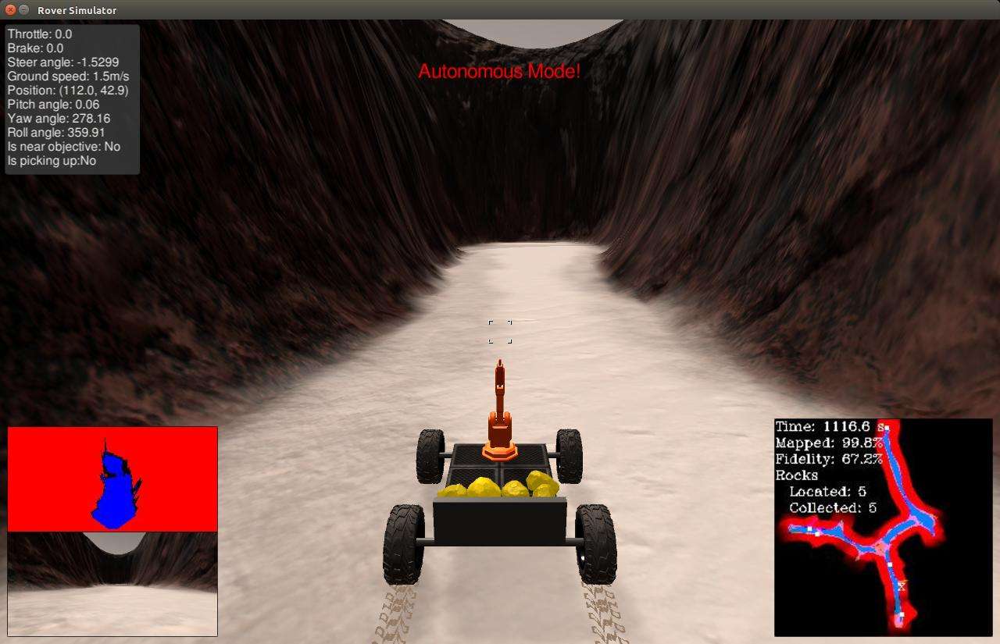

[//]: # (Image References)
[image_0]: ./misc/rover_image.jpg
[](https://www.udacity.com/robotics)
# Search and Sample Return Project


![alt text][image_0] 

This project is modeled after the [NASA sample return challenge](https://www.nasa.gov/directorates/spacetech/centennial_challenges/sample_return_robot/index.html) and it will give you first hand experience with the three essential elements of robotics, which are perception, decision making and actuation.  You will carry out this project in a simulator environment built with the Unity game engine.  

## The Simulator
The first step is to download the simulator build that's appropriate for your operating system.  Here are the links for [Linux](https://s3-us-west-1.amazonaws.com/udacity-robotics/Rover+Unity+Sims/Linux_Roversim.zip), [Mac](	https://s3-us-west-1.amazonaws.com/udacity-robotics/Rover+Unity+Sims/Mac_Roversim.zip), or [Windows](https://s3-us-west-1.amazonaws.com/udacity-robotics/Rover+Unity+Sims/Windows_Roversim.zip).  

You can test out the simulator by opening it up and choosing "Training Mode".  Use the mouse or keyboard to navigate around the environment and see how it looks.

**Autonomous Navigation / Mapping**

The requirement for a passing submission is to map at least 40% of the environment at 60% fidelity and locate at least one of the rock samples (note: you're not required to collect any rocks, just map the location of at least 1). Each time you launch the simulator in autonomous mode there will be 6 rock samples scattered randomly about the environment and your rover will start at random orientation in the middle of the map.

[//]: # (Image References)
[image1]: ./misc/rover_image.jpg
[image2]: ./calibration_images/example_grid1.jpg
[image3]: ./calibration_images/example_rock1.jpg 
[image4]: ./output/warped_example.jpg
[image5]: ./output/warped_path_threshed.jpg
[image6]: ./output/warped_obstacle_threshed.jpg
[image7]: ./output/warped_rock.jpg
[image8]: ./output/warped_rock_threshed.jpg
[image9]: ./output/coordinate_transform.jpg
[image10]: ./output/state_machine.jpg
[image11]: ./output/rock_sample_threshed.jpg

![alt text][image1]

#### Navigation, Obstacle and Sample identification

##### 1. Calibration Data

![alt text][image2] ![alt text][image3]

* Using the 2 pictures above to perform color threshold calibration

##### 2. Perspective Transform

* The function below is used for performing perspective transform. It transform front camera image to global map perspective.
* The grid points is extracted from the calibration data. It is specified in the source variable.
```python
source = np.float32([[14, 140], [301 ,140],[200, 96], [118, 96]])
destination = np.float32([[image.shape[1]/2 - dst_size, image.shape[0] - bottom_offset],
                  [image.shape[1]/2 + dst_size, image.shape[0] - bottom_offset],
                  [image.shape[1]/2 + dst_size, image.shape[0] - 2*dst_size - bottom_offset], 
                  [image.shape[1]/2 - dst_size, image.shape[0] - 2*dst_size - bottom_offset],
                  ])
warped = perspect_transform(grid_img, source, destination)
```
Output result
![alt text][image4]

##### 3. Color Thresholding

###### Navigation Path
* Define the color thresholding function from the lesson and apply it to the warped image
* 160, 140 and 140 threshold are used

![alt text][image4] ![alt text][image5]

###### Obstacle

![alt text][image6]

###### Rock sample
* The RGB threshold value are 100, 100 and 40
* The blue threshold is change to less than(<) instead of the default greater than (>)
```python
def find_rock_thresh(img, rgb_thresh=(100, 100, 40)):
    # Create an array of zeros same xy size as img, but single channel
    color_select = np.zeros_like(img[:,:,0])
    # Require that each pixel be above all three threshold values in RGB
    # above_thresh will now contain a boolean array with "True"
    # where threshold was met
    above_thresh = (img[:,:,0] > rgb_thresh[0]) \
                & (img[:,:,1] > rgb_thresh[1]) \
                & (img[:,:,2] < rgb_thresh[2])
    # Index the array of zeros with the boolean array and set to 1
    color_select[above_thresh] = 1
    # Return the binary image
    return color_select

rock_threshed = find_rock_thresh(find_rock_warped)
plt.imshow(rock_threshed, cmap='gray')
```
- Before perspective transform

![alt text][image11]

- After perspective transform

![alt text][image7] ![alt text][image8]

##### 4. Coordinate Transformations

![alt text][image9]

#### Process image

<a href="https://youtu.be/dpQAHWBvidI" target="_blank"></a>

#### Perception Pipeline
* Since I using left wall following method, the rock sample must be detected on the left side of the robot. It will make the pick up of the rock sample more easier. 
* Under the perception_step(), the condition for flagging the rock_found is when the distance is less than 80 and angle is greater than 0 degree.

```python
    # See if we can find some rocks
    if rock_threshed_img.any():
        rock_x_world, rock_y_world = pix_to_world(rock_x_rover, rock_y_rover, rover_xpos, rover_ypos, rover_yaw, world_size, scale)
        rock_dists, rock_angles = to_polar_coords(rock_x_rover, rock_y_rover)
        rock_idx = np.argmin(rock_dists)
        rock_xcen = rock_x_world[rock_idx]
        rock_ycen = rock_y_world[rock_idx]
        Rover.rock_dists = rock_dists
        Rover.rock_angles = rock_angles
        # Get the rock mean angle and distance
        mean_rock_dist = np.mean(Rover.rock_dists)
        mean_rock_angle = np.mean(Rover.rock_angles) * 180/np.pi
        print(mean_rock_dist)
        print(mean_rock_angle)
        # Identify rock when the rock distance is equal or less than 100.0 
        # and the rock is on the left side of the robot which is greater than 0 degree
        if mean_rock_dist <= 100.0 and mean_rock_angle >= 0:
            Rover.rock_found = True

```

#### Decision State Machine
* I using the left wall following method, the robot will alway steer to the left side.
* There are total of 6 states.
* forward, stop, recovery, steering_to_rock, slow_forward_to_rock, pick_up_rock

![alt text][image10]

#### Final Result

* Located: 5 rock samples
* Collected: 5 rock samples
* Mapped: 99.8%
* Fidelity: 67.2%

<a href="https://youtu.be/LmgOaJYmFpw" target="_blank"></a>


